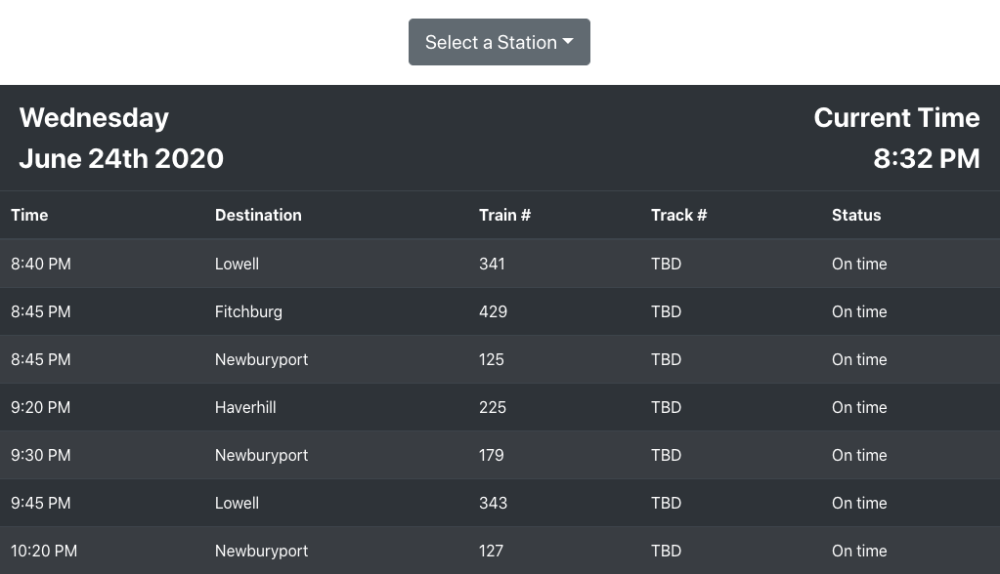

# MBTA Departure Board

MBTA Departure Board displays the Commuter Rail departures from Boston's North and South Stations. It was created with React and Python.



## Installation

Install React dependencies from the front end directory (`./mbta_front_end`) by running `npm install`.

You do not have to install any Python FastAPI dependencies, as they are installed via the Docker container build.

## Running the App

To run the front end, run `npm start` from the front end directory (`./mbta_front_end`).

To build and run the back end, run `docker-compose up web` from the root directory.

## Running Tests

To run Python FastAPI tests, use `docker-compose up tests` from the root directory.

```bash
tests/test_main.py ...                                                                                                                                                           [100%]

---------- coverage: platform darwin, python 3.8.3-final-0 -----------
Name                                     Stmts   Miss  Cover
------------------------------------------------------------
insurify_mbta_pilot/__init__.py              1      0   100%
insurify_mbta_pilot/departure_utils.py      40      1    98%
insurify_mbta_pilot/main.py                 21      0   100%
------------------------------------------------------------
TOTAL                                       62      1    98%
```

## Assumptions

- I removed the API key (looks like you don't need it) so it's not exposed in GitHub.
- The board is for Commuter Rail departures only.
- Users can view departures for North Station and South Station, toggling via a dropdown.
- Trains that have already left the station (status=departed) should be not shown on the board.
- All valid departures available from the API should be displayed (as opposed to only those within a certain bracket of time)
- A minimally styled, working solution is acceptable.

## Next Up

- Write tests for the front end.
- Handle `null` statuses in a more elegant way (right now, showing 'Unknown').
- Make cuter. :)
